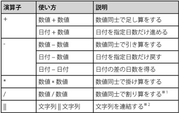
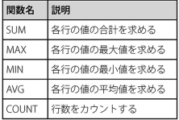
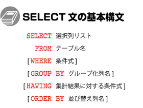
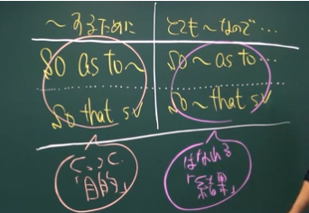

## 取り組んだ課題一覧
- スッキリわかるSQL入門 第3版
- CodeWars Kata: [Jaden Casing Strings](https://www.codewars.com/kata/5390bac347d09b7da40006f6/ruby)
- CodeWars Kata: [Number of People in the Bus](https://codewars.com/kata/5648b12ce68d9daa6b000099/ruby)
- CodeWars Kata: [Odd or Even?](https://www.codewars.com/kata/5949481f86420f59480000e7/ruby)
## わかったこと
###### Ruby
```ruby
class String
  def toJadenCase
    self.split.map(&:capitalize).join(" ")
  end
end
```
- 上記のように`self`を使うとそのメソッドを呼び出したインスタンス自体を指定する。
- `split`: 引数がnilだと(' ')と同じ。
- `(&:capitalize)`は`{ |e| e.capitalize }`の簡略的な書き方。各要素ごとに指定したメソッドが呼び出される。例の場合capitalizeが呼び出されている。
###### SQL
- SELECT文などで`列名 + 100`のように計算式や固定値を入れることができる。
- 代表的な演算子の使い方

- `CASE演算子`: 列の値や条件式を評価して、その結果に応じて自由に変換する。2通りの使い方がある
```sql
CASE 評価する列や式 WHEN 値1 THEN 値1の時に返す値
                   (WHEN 値2 THEN 値2の時に返す値)...
                   (ELSE デフォルト値)
END
```
```sql
CASE WHEN 条件1 THEN 条件1の時に返す値
    (WHEN 条件2 THEN 条件2の時に返す値)...
    (ELSE デフォルト値)
END
```
`LENGTH関数`: 文字列の長さを表す数値を返す。引数は列名または式
`TRIM関数`: 文字列の前後の空白を取り除く。先頭にLで左のみRで右のみの空白を消せる。LTRIM,RTRIM
- `REPLACE関数`: 文字列の一部を別の文字列に置換する。`REPLACE (置換対象の文字列, 置換前の部分文字列, 置換後の部分文字列)`
- `SUBSTRING関数`: 文字列の一部分だけを取り出す。`SUBSTRING (文字列を表す列, 抽出を開始する位置, 抽出する文字の数)`
- `CONCAT関数`: 文字列を連結する。`CONCAT (文字列, 文字列,...)`
- `ROUND関数`: 指定した位置で四捨五入をした結果を返す。`ROUND (列, 有効とする桁数)`切れり捨ての場合は`TRUNC`
- `POWER関数`: べき乗を返す。
- `CURRENT_TIMESTAMP`: 現在の日時
- `CURRENT_DATE`: 現在の日付
- `CURRENT_TIME`: 現在の時刻
- `CAST関数`: あるデータ型を別の型として扱うようにする。`CAST (変換する値 AS 変換する型)`
- `COALESCE`: 複数の引数を受け取り、受け取った引数を左から順番にチェックしてその中から最初に見つかったNULLでない引数を返す。NULLガード
- 関数はDBMSによって大きく異なるので注意。
- 関数は負荷が増大する可能性があるので注意
- 代表的な集計関数

- `COUNT関数`: 検索結果の行数を数える。`COUNT(列)`だとNULLを無視してカウントする。
- 集計関数はSELECT文でしか利用できない。
- グループ化: 集計に先立って、指定した基準で検索結果をいくつかのまとまりに分けること。基本構文:
```sql
SELECT グループ化の基準列名... , 集計関数
FROM テーブル名
(WHERE 絞り込み条件)
GROUP BY グループ化の基準列名...
HAVING 集計結果に対する絞り込み条件
```
- グループ集計の流れ

- `HAVING`: 集計処理を行ったあとの結果表に対して絞り込みを行う。
- SELECT文の基本構文

- 集計テーブル: 大量のデータを扱う場合に使う。集計結果をあらかじめ別のテーブルに登録しておく。
## 次やること
- スッキリわかるSQL入門 第3版
## 感じたこと
- 練習問題がたまに意味が分からなくて困る。国語力が足りない？
## 学習時間
- 本日　4時間06分
- 合計　385時間07分


# 英語
## 取り組んだ課題一覧
- スタディサプリ TEPPAN英単語 1~100 6回目
- スタディサプリ パーフェクト講義英文法編009 008
## わかったこと
- 分からなかった単語
    - against: ～に対して、～に反対して
    - certain: 確かな、ある
    - afraid: 心配して、恐れて
    - actually: 実際は、実際に
- 不定詞の概念
    - 不定詞をとる動詞。want,intend,offer,hesitate,refuseなど
    - 不定詞は未来志向。これから～
    - 不定詞はプラスイメージ(明るい動詞はtoをとりやすい)
    - want to ~（～したい）、hope to ~（～したいと望む）、wish to ~（～したいと願う）の3つは確実に覚える。
- to 不定詞を使った慣用表現1
    - so as to ~ (～するために) so that SVと同じ　目的を表す
    - so ~ as to... (とても～なので) so ~ that SVと同じ　結果を表す
    
## 次やること上
- スタディサプリ TEPPAN英単語 1~100 7回目
- スタディサプリ パーフェクト講義英文法編009
## 感じたこと
- 確認テストの出来は微妙。答えがあっていても大体しか読めてない。
## 学習時間
- 本日　1時間00分
- 合計　31時間05分