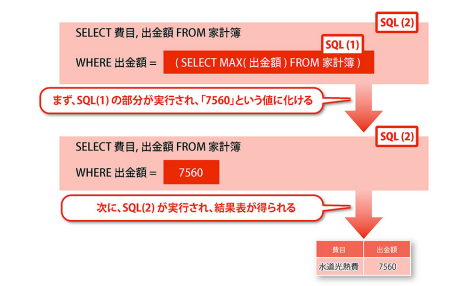

## 取り組んだ課題一覧
- スッキリわかるSQL入門 第3版 7章まで
- CodeWars Kata: [Growth of a Population](https://www.codewars.com/kata/563b662a59afc2b5120000c6/ruby)
- CodeWars Kata: [Testing 1-2-3](https://www.codewars.com/kata/54bf85e3d5b56c7a05000cf9/ruby)
- CodeWars Kata: [Sum of odd numbers](https://www.codewars.com/kata/55fd2d567d94ac3bc9000064/solutions/ruby)
## わかったこと
###### Ruby
- `with_index`は`map`と一緒に使う？
- `stepメソッド`: Numericクラスのメソッド。self からはじめ step を足しながら limit を越える前までブロックを繰り返す。stepは各ステップの大きさを指定できる。`self.step(limit,step){}`
###### SQL
- SELECT文をネストできる。副問い合わせという。ネストされた方から実行される。使い方は関数と似ている。
- 副問い合わせの動作

- 副問い合わせの３つのパターン
    - 単一の値の代わりとして、副問い合わせの検索結果を用いる。SELECT,FROM,UPDATEのSET,WHERE句などで使える。
    - 複数の値の代わりとして、副問い合わせの検索結果を用いる。WHERE句の条件式(INやANYなど)や、SELECT文のFROM句に使う。
    - 表の値の代わりとして、副問い合わせの検索結果を用いる。FROM句やINSERT文で使うINSERT文の時は`{}`がいらない。
- 副問い合わせの結果にNULLがある場合全体の結果もNULLになってしまうので、`WHERE xx IS NOT NULL`や`SELECT COALESCE(xx '不明')`のようにNULLにならないようにする。
## 次やること
- スッキリわかるSQL入門 第3版 8章から
## 感じたこと
- SQL苦手かもしれない。
## 学習時間
- 本日　3時間08分
- 合計　388時間35分

# 英語
## 取り組んだ課題一覧
- スタディサプリ TEPPAN英単語 101~200 1回目
## わかったこと
- 特になし
## 次やること上
- スタディサプリ TEPPAN英単語 101~200 2回目
- スタディサプリ パーフェクト講義英文法編011
## 感じたこと
- 新しい単語の1日目は時間がかかる。
## 学習時間
- 本日　1時間00分
- 合計　32時間16分