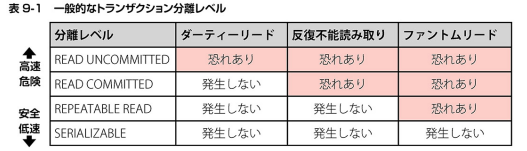

## 取り組んだ課題一覧
- スッキリわかるSQL入門 第3版 8章まで
- CodeWars Kata: [Ones and Zeros](https://www.codewars.com/kata/578553c3a1b8d5c40300037c/ruby)
- CodeWars Kata: [Two to One](https://www.codewars.com/kata/5656b6906de340bd1b0000ac/ruby)
- CodeWars Kata: [Small enough? - Beginner](https://www.codewars.com/kata/57cc981a58da9e302a000214/ruby)
## わかったこと
###### SQL
- トランザクション: DBMSに対して複数のSQL文を送る際、1つ以上のSQL文をひとかたまりとして扱うように指示できる。そのかたまりのこと。
- トランザクションを使うための指示
    - `BEGIN`: 開始の指示。
    - `COMMIT`: 終了の指示。
    - `ROLLBACK`: 明示的にロールバッグを発生させる。
- 一般的なトランザクション分離レベル

- たいていは`READ COMMITTED`を選んでおけばOK
```sql
SET TRANSACTION ISOLATION LEVEL 分離レベル
SET CURRENT ISOLATION 分離レベル
```
## 次やること
- スッキリわかるSQL入門 第3版 9章から
## 感じたこと
- 最近なかなか勉強しようと思えない。
## 学習時間
- 本日　1時間21分
- 合計　391時間35分


# 英語
## 取り組んだ課題一覧
- スタディサプリ TEPPAN英単語 101~200 5回目
## わかったこと
- 特になし
## 次やること上
- スタディサプリ TEPPAN英単語 101~200 6回目
- スタディサプリ パーフェクト講義英文法編011
## 感じたこと
- 新しい単語の3日目だけどあんまり覚えれていない。
## 学習時間
- 本日　0時間10分
- 合計　33時間40分