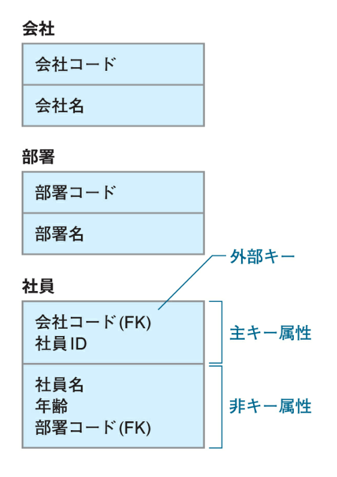
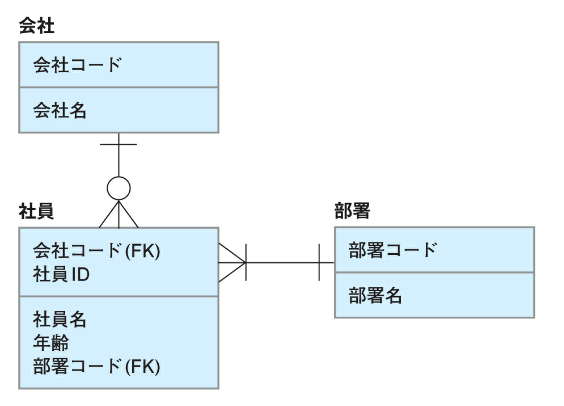

## 取り組んだ課題一覧
- 達人に学ぶDB設計
- CodeWars Kata: [Mexican Wave](https://www.codewars.com/kata/58f5c63f1e26ecda7e000029/ruby)
## わかったこと
###### SQL
- 論理設計のステップ
    - エンティティの抽出: システムのためにどのようなデータ(エンティティ)が必要になるか抽出する。「要件定義」と一部重なっている。
    - エンティティの定義: 各エンティティがどのようなデータを保持するかを決める。エンティティはデータを「属性」という形で保持する。
    - 正規化: エンティティについて、システムでの利用がスムーズに行えるように整理する。
    - ER図の作成: エンティティ同士の関係を表現する図(ER図)を作成する。
- 物理設計のステップ
    - テーブル定義
    - インデックス定義
    - ハードウェアのサイジング
    - ストレージの冗長構成決定
    - ファイルの物理配置決定
- データベースのRAIDは少なくともRAID5で構成する。予算に余裕があればRAID10。RAID0は論外。
- テーブル名は英語なら複数形・複数名詞でかける。そうでなければそのテーブルにはどこか間違いがある。
- 正規化はテーブルのすべての列が関数従属性を満たすように整理していくこと。
- 第1正規形: 1つのセルの中に1つの値しか含まない
- 第2正規形: テーブル内の部分関数従属を解消し、完全関数従属のみのテーブルをつくること。
- 部分関数従属: 一部の列に対して従属する列がある場合の関係のこと。
- 第3正規形: 推移的関数従属によるデータ登録時の不都合を解消するために、テーブルを分割してそれぞれの関数従属の関係を独立させること。
- 推移的関数従属: テーブル内部に存在する段階的な従属関係のこと。
- テーブルの表記法
    - 上スペースに主キー属性。下スペースに非キー属性。外部キーに`(FK)`と記述

- IE表記法でのER図の記述法
    - 〇: 0
    - ー: 1
    - 鳥の足: 2以上

- 正規化と検索SQLのパフォーマンスはトレードオフの関係。
- SQL文を考える時のコツは「FROM句から考える」
- 意味的に分割できる限り、なるべく分割して保持する
## 次やること
- [小学生でもわかるデータベース設計入門。実際に設計しながら基礎を学ぼう](https://www.youtube.com/watch?v=Yg546Zua39A)
- twitterのデータモデリング
## 感じたこと
- ふんわりとしか理解できていないので2回目を読む
## 学習時間
- 本日　4時間04分
- 合計　419時間56分

# 英語
## 取り組んだ課題一覧
- スタディサプリ TEPPAN英単語 301~400 5回目
## わかったこと
- 分からなかった単語
    - proof: 証拠、証明、試験
    - worth: 〜価値がある
    - refer: 言及する、参照する
    - encourage: 〜を奨励する、促進する
    - regret: 残念ながら〜する、〜を後悔する
    - concern: 関心こと、懸念
    - replace: 〜を取り替える、〜に取って代わる
    - affect: 〜に影響を及ぼす
    - conduct: 〜を実行する
    - afford: 余裕がある
    - satisfy: 〜を満足させる
    - confirm: 〜を確認する
## 次やること上
- スタディサプリ TEPPAN英単語 301~400 6回目
- スタディサプリ パーフェクト講義英文法編011
## 感じたこと
- だいぶ覚えてきたが、最近文法できてない。
## 学習時間
- 本日　0時間21分
- 合計　38時間45分