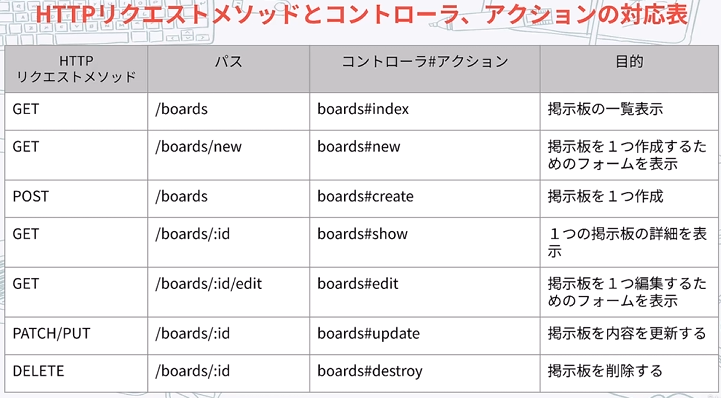

## 取り組んだ課題一覧
- CodeWars Kata: [Simple frequency sort](https://www.codewars.com/kata/5a8d2bf60025e9163c0000bc/solutions/ruby)
- Udemy: [フルスタックエンジニアが教える 即戦力Railsエンジニア養成講座](https://www.udemy.com/course/rails-kj/?couponCode=ST22FS22724) セッション8まで
## わかったこと
###### Ruby
- `sort_by{ |e| -arr.count(e)}`: このようにすることで数が多い順にソートされる。`-`がなければ少ない順。`[-arr.count(e), e]`のように記述することで複数のルールを付けられる。
- `flatten`: Arrayクラスのメソッド。配列を平坦化する。例`[1, [2, 3, [4], 5]] => [1, 2, 3, 4, 5]`
###### Rails
- Railsの基本理念
    - 同じことは繰り返すな(Don't Repeat yourself: DRY)
    - 設定より規約が優先される(Convention Over Configuration)
- MVCアーキテクチャ
    - ルーティング→Controller→Model→Controller→View→Controller
    
- ルーティングの設定
    - config/routes.rbに`"boards#index"`のような形で記述
- コントローラーの作成
    - app/controllersに`boards_controller.rb`のような名前で作成
    ```ruby
    class BoardsController < ApplicationController
        def index
        end
    end
    ```
    - `boards_controller.rb`に上記のように記述
- ビューの作成
    - app/viewsにコントローラー名でフォルダを作りそこにビューを作成する。`app/views/boards/index.html.erb`
- Bootstrapの適用方法
    - Gemfileに`"bootstrap","sassc-rails","mini_racer"`を追加して、再ビルド。
    - app/assets/stylesheets/application.cssを`.scss`に変更。bootsrapをインポートする。`@import "bootstrap";`
    - `docker compose run web rails importmap:install`でconfig/importmap.rbを作成。下記のように記述
    ```ruby
    pin "application", preload: true
    pin "bootstrap", to: "bootstrap.min.js", preload: true
    pin "popper", to: "popper.js", preload: true
    ```
    - config/initializers/assets.rbに`Rails.application.config.assets.precompile += %w(bootstrap.min.js popper.js)`のように記述
    - app/javascript/application.jsに下記を記述
    ```js
    import "popper"
    import "bootstrap"

    window.onload = function() {
        const popoverTriggerList = document.querySelectorAll('[data-bs-toggle="popover"]')
        const popoverList = [...popoverTriggerList].map(d => new bootstrap.Popover(d))
        const tooltipTriggerList = document.querySelectorAll('[data-bs-toggle="tooltip"]')
        const tooltipList = [...tooltipTriggerList].map(d => new bootstrap.Tooltip(d))
    }
    ```
- app/views/layouts/application.html.erbは共通のビュー。そのなかの`<%= yield %>`のところに他のビューが挿入されてHTMLになる
- app/assets/stylesheets/に.scssファイルを作成して/application.scssにimportするとCSSを個別に追加できる
- `rails generate model`: モデルと関連するマイグレーションファイルを生成
- `rails generate controller`: コントローラと関連するビューファイルを生成
- モデルの作成
    - `docker compose run web rails g model board author_name:string title:string body:text`のようなコマンドでmigrationファイルとモデルを作成
    - `rails db:migrate`: テーブル作成
    - `rails db:rollback`: テーブル削除
- 基本となるRESTfullなメソッド

- `form_with`: フォームヘルパー。いい感じにフォームが作れる
- `gem "pry-byebug"`をインストールしてテストした場所に`binding.pry`と記述すると`docker attach rails-practice-web-1`のようにしておいたターミナルでテストができる
## 次やること
- Udemy: [フルスタックエンジニアが教える 即戦力Railsエンジニア養成講座](https://www.udemy.com/course/rails-kj/?couponCode=ST22FS22724) セッション9から
- Railsチュートリアル
## 感じたこと
- Rails7が途中で終わってしまった。5をやるかRails チュートリアルをやるかどうしようか？
## 学習時間
- 本日　4時間20分
- 合計　437時間43分


# 英語
## 取り組んだ課題一覧
- スタディサプリ TEPPAN英単語 401~500 5回目
- スタディサプリ TEPPAN英単語 1~100(復習) 3回目
## わかったこと
## 次やること上
- スタディサプリ TEPPAN英単語 401~500 6回目
- スタディサプリ TEPPAN英単語 1~100(復習) 4回目
- スタディサプリ パーフェクト講義英文法編011
## 感じたこと
- だいぶ覚えてきたが、最近文法できてない。
## 学習時間
- 本日　0時間23分
- 合計　41時間54分