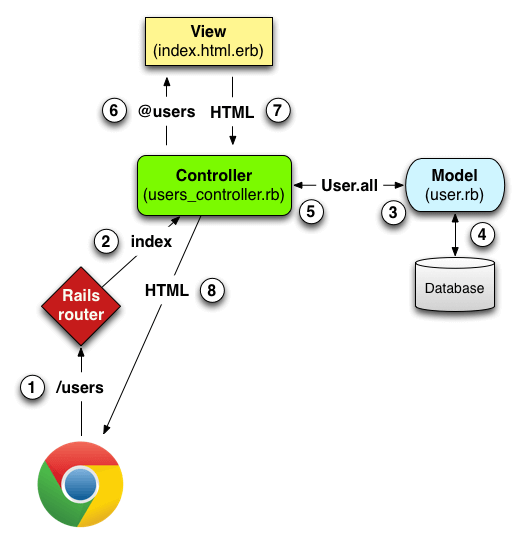

## 取り組んだ課題一覧
- Railsチュートリアル 1章
## わかったこと
###### Rails
- Renderでのデプロイ手順
    - リポジトリなどの選択をする
    - 環境変数を設定する
    - RAILS_MASTER_KEY: config/master.keyの中身
    - RAILS_ENV: production
    - Blicked hostsというエラーが出るので、config/environments/production.rb内の`Rails.application.configure do`ブロック内に`config.hosts << "URL"`を記述する。[リファレンス](https://guides.rubyonrails.org/configuring.html#actiondispatch-hostauthorization)
    - config/master.keyはリポジトリにコミットしない！
- `rails g scaffold <モデル名> <カラム名>:<型名>`: 良い感じに全て作ってくれる。例: `docker compose run web rails generate scaffold User name:string email:string`
- RailsにおけるMVC

- app/models/...に`validates :content, length: { maximum: 140 }`のように記述することでバリデーションを設定できる。これは140文字まで。
- `presence: true`: 空だと送信できなくするバリデーション
- modelに`belongs_to :xxx`(1つのxxxは1つのyyyにのみ属する),`has_many :yyy`(1つのyyyは複数のxxxがある)などでモデル同士を関連付けすることができる。
## 次やること
- Railsチュートリアル
## 感じたこと
- Renderのデプロイが難しい。ただデプロイの中だと簡単なサイトだと思う
## 学習時間
- 本日　2時間12分
- 合計　443時間02分

# 英語
## 取り組んだ課題一覧
- スタディサプリ TEPPAN英単語 501~600 1回目
- スタディサプリ TEPPAN英単語 101~200(復習) 1回目
## わかったこと
## 次やること上
- スタディサプリ TEPPAN英単語 501~600 2回目
- スタディサプリ TEPPAN英単語 101~200(復習) 2回目
- スタディサプリ パーフェクト講義英文法編011
## 感じたこと
- だいぶ覚えてきたが、最近文法できてない。
## 学習時間
- 本日　1時間08分
- 合計　43時間21分