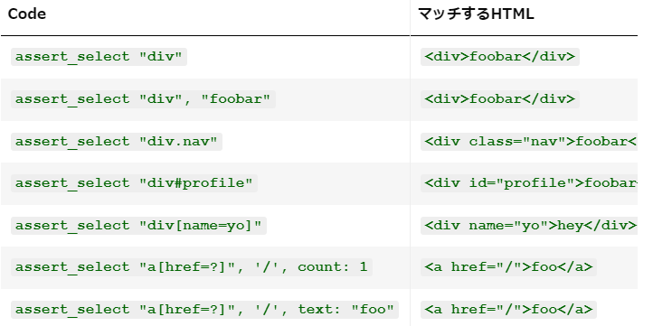

## 取り組んだ課題一覧
- Railsチュートリアル 6章途中まで
## わかったこと
###### Rails
- Bootstrap導入方法
    - `bootstrap-sass`,`sassc-rails`をbandle install
    - SCSSファイルに`@import "bootstrap-sprockets";`,`@import "bootstrap";`を記述
- `パーシャル`: ビューのコードをモジュール化し、再利用可能な部品に分割するための仕組み。先頭にアンダースコア _ をつけて命名する。renderの時はアンダースコア入らない
- `アセットパイプライン`: ウェブアプリケーションのCSS、JavaScript、画像などの静的アセットを管理、圧縮、そして提供するための機能。
    - `application.css`や`application.js`に下記を記述してファイルを結合する
    ```css
    /*
    *= require_self
    *= require_tree .
    */
    ```
    - 本番環境にデプロイする前に`rake assets:precompile`を実行してアセットを事前コンパイルする必要がある
- Sassは`$light-gray: #777;`のようにして変数を定義できる。
- Railsではサイト内のページにリンクを張る時、`<a href="/static_pages/about">About</a>`のように直接HTMLを記述するのではなく、`<%= link_to "About", about_path %>`のように`link_to`と名前付きルーティングを使うのが慣例となっている。
- 名前付きルーティングを使うためにはroutesを`get  "static_pages/help"`のような形から`get  "/help",    to: "static_pages#help"`のように変更する。
- 名前付きルーティングは、`as:`オプションを使って変更することができる
- `統合テスト（Integration Test）`: アプリケーションの動作を端から端まで（end-to-end）シミュレートしてテストすることができる。`rails generate integration_test <テスト名>`。`rails test:integration`でintegrationのみを行える。下記は例:
```ruby
require "test_helper"

class SiteLayoutTest < ActionDispatch::IntegrationTest

  test "layout links" do
    get root_path
    assert_template 'static_pages/home'
    assert_select "a[href=?]", root_path, count: 2
    assert_select "a[href=?]", help_path
    assert_select "a[href=?]", about_path
    assert_select "a[href=?]", contact_path
  end
end
```
- `assert_select "a[href=?]", about_path`は`<a href="/about">...</a>`というHTMLがあるかどうか確認する。
- `assert_select "a[href=?]", root_path, count: 2`は2つあるか確認する。
- `assert_select`リスト

- ログインなどの認証システムを実装する標準ライブラリは[Devise](https://github.com/heartcombo/devise)というgemがおすすめ。
- `Active Record`: データベースとやりとりをするデフォルトのRailsライブラリ。
- `db/schema.rb`というファイルにはデータベースの構造を追跡するためのものがある。
## 次やること
- Railsチュートリアル 6章途中から
## 感じたこと
- 思ったより時間がとれなかった
## 学習時間
- 本日　2時間53分
- 合計　453時間27分


# 英語
## 取り組んだ課題一覧
- スタディサプリ TEPPAN英単語 501~600 4回目
- スタディサプリ TEPPAN英単語 101~200(復習) 4回目
## わかったこと
## 次やること上
- スタディサプリ TEPPAN英単語 501~600 5回目
- スタディサプリ TEPPAN英単語 101~200(復習) 5回目
- スタディサプリ パーフェクト講義英文法編011
## 感じたこと
- だいぶ覚えてきたが、最近文法できてない。
## 学習時間
- 本日　0時間36分
- 合計　44時間44分