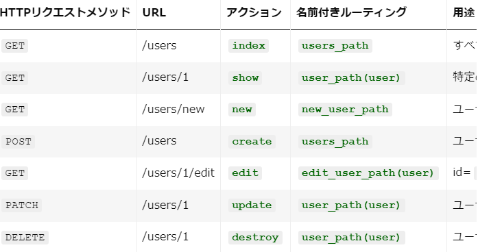

## 取り組んだ課題一覧
- Railsチュートリアル 6章途中まで
## わかったこと
###### Rails
- `debug(params) `: デバッグ用の情報が表示されるようになる
```scss
.debug_dump {
  clear: both;
  float: left;
  width: 100%;
  margin-top: 45px;
}
```
- 上記のように整形できる。
- `if Rails.env.development?`: 開発環境（development）だけで表示されるようになる。
- `rails server --environment production`: 本番環境でサーバーを起動する。`rails db:migrate RAILS_ENV=production`をしておき必要がある。
- `resources :users`: config/routes.rbに記述。一連のルーティングが定義される。

- viewとcontrollerの設定は必要。例:
```rb
  def show
    @user = User.find(params[:id])
  end
```
- `rails routes`: 定義されたルーティングを表示するコマンド
- `debuggerメソッド`: デバッグしたい場所に記述してそのページにアクセスすると、rails s を起動しているターミナルにプロンプトが表示される。
- `form_withヘルパーメソッド`: フォームを作成する際に使う。
```ruby
<%= form_with model: @article, local: true do |form| %>
  <%= form.label :title %>
  <%= form.text_field :title %>

  <%= form.label :content %>
  <%= form.text_area :content %>

  <%= form.submit "Submit" %>
<% end %>
```
- `Strong Parameters`: Railsで使用されるセキュリティ機能の一つで、マスアサインメントの脆弱性からアプリケーションを保護するために設計されている。例:
```ruby
class UsersController < ApplicationController
  def create
    @user = User.new(user_params)
    if @user.save
      # 成功した場合の処理
    else
      # 失敗した場合の処理
    end
  end

  private

  def user_params
    params.require(:user).permit(:name, :email)
  end
end
```
- エラーメッセージ
    - formに`<%= f.text_field :name, class: 'form-control' %>`のように`form-control`というクラスを追加するとBootstrapが適切なスタイルを与えてくれる。
    - `<%= render 'shared/error_messages' %>`のようにrenderする。複数のビューで使われるパーシャルは専用のディレクトリ「shared」によく置かれる。ファイル名の最初の文字は`_`
    ```html
    <% if @user.errors.any? %>
      <div id="error_explanation">
        <div class="alert alert-danger">
        The form contains <%= pluralize(@user.errors.count,   "error") %>.
        </div>
        <ul>
          <% @user.errors.full_messages.each do |msg| %>
          <li><%= msg %></li>
          <% end %>
        </ul>
      </div>
    <% end %>
    ```
    - `pluralize`: 第1引数に整数を渡すと、それに基づいて第2引数の英単語を複数形に変更したものを返す。
    - Railsは、無効な内容の送信によって元のページに戻されると、CSSクラス`field_with_errors`を持ったdivタグでエラー箇所を自動的に囲んでくれる。
- テスト例: `rails generate integration_test users_signup`
    - `get signup_path`: まずはgetメソッドを使ってユーザー登録ページにアクセス
    - `assert_no_difference 'User.count' do ...end`: createアクションのUser.newで期待されているデータを、params[:user]というハッシュにまとめる。paramsハッシュを明示的に含めることが推奨されている。assert_no_differenceのブロックを実行する前後で引数の値（User.count）が変わらないことをテストしている。
    - `assert_response :unprocessable_entity`: アクションがHTTPステータスコード422(Unprocessable Entity)を返すことを検証
    - `assert_template 'users/new'`: 指定したテンプレート（この場合はusers/new）が実際にレンダリングされることを検証
```ruby
require "test_helper"

class UsersSignupTest < ActionDispatch::IntegrationTest

  test "invalid signup information" do
    get signup_path
    assert_no_difference 'User.count' do
      post users_path, params: { user: { name:  "",
                                         email: "user@invalid",
                                         password:              "foo",
                                         password_confirmation: "bar" } }
    end
    assert_response :unprocessable_entity
    assert_template 'users/new'
  end
end
```
- ユーザー登録に成功した場合は別のページにリダイレクト（Redirect）する方がWebでは一般的
```ruby
def create
  @user = User.new(user_params)
  if @user.save
    flash[:success] = "Welcome to the Sample App!"
    redirect_to @user
  else
    render 'new', status: :unprocessable_entity
  end
end
```
- 上記のように`redirect_to @user`でリダイレクトする。
- `redirect_to @user`と`redirect_to user_url(@user)`は同じ意味。
- flash
    - flash変数に代入したメッセージは、リダイレクトした直後のページで表示できるようになる。
    - flashはハッシュのように扱う。
    - Railsの一般的な慣習に沿って、:successというキーには成功時のメッセージを代入する。
    - Bootstrap CSSは、このようなflashのクラス用に4つのスタイルを持っている(success、info、warning、danger)alert-success
    - `flash[:success] = "Welcome to the Sample App!"`
    - viewに下記のように記述
    ```html
    <% flash.each do |message_type, message| %>
      <div class="alert alert-<%= message_type %>"><%= message %></div>
    <% end %>
    ```
- `rails db:migrate:reset`: データベースの内容をリセット
- 成功時のテスト
    - `assert_difference`: 第1引数に文字列を取り、ブロック内の処理を実行する直前と、実行した直後のUser.countの値を比較。第2引数はオプションですが、ここには比較した結果の差異（今回の場合は1）を渡す。
    - `follow_redirect!`: POSTリクエストを送信した結果を見て、指定されたリダイレクト先に移動するメソッド。
    ```ruby
    test "valid signup information" do
      assert_difference 'User.count', 1 do
        post users_path, params: { user: { name:  "Example   User",
                                           email:   "user@example.com",
                                           password:                "password",
                                           password_confirmati  on: "password" } }
      end
      follow_redirect!
      assert_template 'users/show'
    end
    ```
- [progresql本番環境デプロイ方法](https://railstutorial.jp/chapters/sign_up?version=7.0#sec-professional_grade_deployment)
- `if user && user.authenticate(params[:session][:password])`: 「ユーザーがデータベースにあり、かつ、認証に成功した場合にのみ」
- `flash`: リダイレクトを伴う場合に使用し、次のリクエストまでメッセージが持続する。
- `flash.now`: リダイレクトなしで現在のビューを再レンダリングする場合に使用し、メッセージは現在のリクエストでのみ表示される。
- `session[:user_id] = user.id`: Railsで事前定義済みのsessionメソッドを使って、単純なログインができる。sessionメソッドはハッシュのように扱える。
```ruby
class ApplicationController < ActionController::Base
  include SessionsHelper
end
```
- 上記のようにApplicationコントローラにincludeすることでどのコントローラからでもそのメソッドを呼び出せるようになる。
- `reset_session`: セッションをリセットするために使用される。現在のセッションデータを完全に削除し、新しいセッションを開始する時に使う。
- findメソッドはnilの時に例外が発生する。find_byメソッドだと発生しないので、nilでも例外が出てほしくないときはfind_byを使う。
- `メモ化(memoization)`: メソッド呼び出しの結果を変数に保存し、次回以降の呼び出しで再利用する手法
- `@current_user ||= User.find_by(id: session[:user_id])`: このように書くのが一般的 
## 次やること
- Railsチュートリアル 6章途中から
## 感じたこと
- 思ったより時間がとれなかった
## 学習時間
- 本日　5時間59分
- 合計　461時間58分


# 英語
## 取り組んだ課題一覧
- スタディサプリ TEPPAN英単語 501~600 6回目
- スタディサプリ TEPPAN英単語 101~200(復習) 6回目
## わかったこと
- 分からなかった単語
    - distribute: ～を配布する、分配する
    - absolutely: 完全に、間違いなく
    - appreciate: ～に感謝する、～を正しく理解する
    - appropriate: 適切な
    - accurate: 正確な
    - procedure: 手順、手続き
    - assure: ～だと保証する
    - instead: その代わりに
## 次やること上
- スタディサプリ TEPPAN英単語 501~600 7回目
- スタディサプリ TEPPAN英単語 101~200(復習) 7回目
- スタディサプリ パーフェクト講義英文法編011
## 感じたこと
- だいぶ覚えてきたが、最近文法できてない。
## 学習時間
- 本日　0時間24分
- 合計　45時間45分