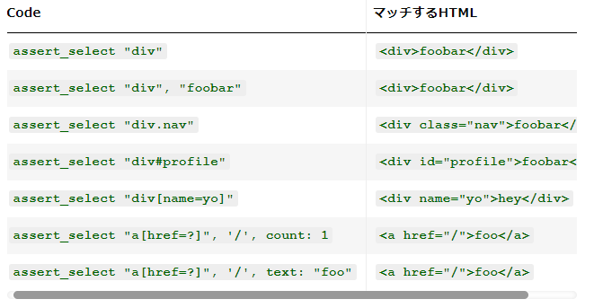

## 取り組んだ課題一覧
- CodeWars Kata: [Simple Fun #81: Digits Product](https://www.codewars.com/kata/589436311a8808bf560000f9/solutions/ruby)
- Railsチュートリアル 13章途中まで
## わかったこと
###### Ruby
- `downto(min) {|n| ... }`: self から min まで 1 ずつ減らしながらブロックを繰り返し実行する。`9.downto(2)`なら数値9から始まり、2まで1ずつ減少していく数値になる。`(2..9).to_a.reverse`よりもこっちの方が良い？
###### Rails
- `<li id="micropost-<%= micropost.id %>">`: のようにするのが柔軟性があってよい。
- `paginateメソッド`: will_paginateやkaminariのようなRailsのページネーションに関するgemに提供されるメソッド。`page: params[:page]`のように使う。page: params[:page]は、現在のページ番号を指定します。この番号は、URLのパラメータから取得される。（例：?page=2）ユーザーがブラウザで異なるページ番号のリンクをクリックすると、そのページに対応するマイクロポストのセットが表示される。
- あるかどうか分からないものを表示するときは`if @user.microposts.any?`のようにあったら表示する。みたいにする。
- `time_ago_in_wordsメソッド`: RailsのActionViewヘルパーの一つで、特定の過去の時刻を「〜前」の形式で表現する。`time_ago_in_words(3.hours.ago) # => 約3時間前`
- `Faker::Lorem.sentence`: Faker gemのメソッド。lorem ipsumと呼ばれるダミーのテキストを返す。
- `takeメソッド`: RailsのActive Recordクエリメソッドの一つ。指定された数のレコードをデータベースから取得するために使う。take(6)はデータベースから最初の6レコードを取得する。
- `assert_select`: HTMLの構造をテストするために使われるメソッド。このメソッドは、特定のHTML要素が期待通りに存在するか、属性やテキストが期待通りかを検証する。`assert_select 'title', 'Home'`なら<title>タグの中に"Home"というテキストが含まれているか。`assert_select 'h1>img.gravatar'`のように書くことでh1の中にあるfravatarクラス付きのimgタグがあるかどうかチェックできる。
- assert_select使用例

- `assert_match`: 特定の文字列やレスポンスボディが期待するパターンにマッチするかどうかをテストする。例:
```rb
# micropostsの総数がその操作の結果として返されたHTTPレスポンス（response.body）に含まれているか
assert_match @user.microposts.count.to_s, response.body
```
- `assert_redirected_to`: 特定のアクションが実行された後にHTTPリダイレクトが適切に行われたかどうかを検証するために使用されるメソッド。
- 複数のコントローラーで使うメソッドは`Applicationコントローラ`に記述する。
## 次やること
- Railsチュートリアル 13章途中から
## 感じたこと
- DeNA QA Night #5に参加してみた。雰囲気が分かったので次は勉強しているところのカンファレンスに参加する。
## 学習時間
- 本日　3時間35分
- 合計　487時間31分


# 英語
## 取り組んだ課題一覧
- スタディサプリ TEPPAN英単語 701~750 3回目
- スタディサプリ TEPPAN英単語 301~400(復習) 3回目
- スタディサプリ パーフェクト講義英文法編002~
## わかったこと
- 完了形の概念
    - 完了形はイメージで覚える
    - 過去から現在まで続いている。現在こうなってるみたいな感じ。現在がメイン
    - 過去完了形は過去から過去で、後者の過去がメイン
    - 未来完了形はどこか(過去でも現在でも)から未来で、未来がメイン。
## 次やること上
- スタディサプリ TEPPAN英単語 701~750 3回目
- スタディサプリ TEPPAN英単語 301~400(復習) 3回目
- スタディサプリ パーフェクト講義英文法編004
## 感じたこと
- なんかやる気がでてきたので文法やり直す。
## 学習時間
- 本日　0時間49分
- 合計　53時間20分