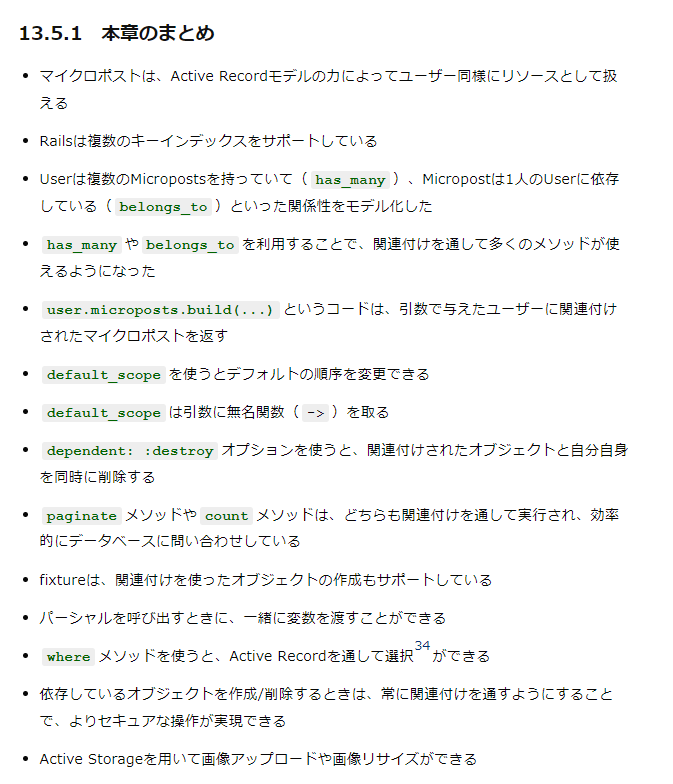

## 取り組んだ課題一覧
- Railsチュートリアル 13章~14章途中まで
## わかったこと
###### Rails
- `ImageMagick`: 画像をリサイズできるプログラム`sudo apt-get install imagemagick`
- `image_processing`: ImageMagickをMiniMagickのインターフェイスを経由して利用できるようにするGem。`mini_magick`も自動的にインストールされる。
- MiniMagickを利用するには`config/application.rb`に下記のように記述する。
```ruby
class Application < Rails::Application
  config.load_defaults 7.0
  # 下記を追加
  config.active_storage.variant_processor = :mini_magick
end
```
- モデルに`resize_to_limit`を使って実装する
```ruby
has_one_attached :image do |attachable|
  attachable.variant :display, resize_to_limit: [500, 500]
end
```
- ビューに`variant(:display)`を使って表示させる。
```ruby
<% if micropost.image.attached? %>
  <%= image_tag micropost.image.variant(:display) %>
<% end %>
```
- 13章まとめ

- `unique: true`: 指定されたカラムの組み合わせでユニークな値のみが許可される。例:`add_index :relationships, [:follower_id, :followed_id], unique: true` この場合はfollower_idとfollowed_idの組み合わせが重複しないようにする。
```ruby
has_many :active_relationships, class_name: "Relationship",
                                foreign_key: "follower_id",
                                dependent: :destroy
```
- 多対多
    - `:active_relationships`: アソシエーションの名前。user.active_relationships.xxxみたいに使えるようになる。名前は決められる。
    - `class_name: "Relationship"`: 参照するモデルのクラス名を指定。
    - `foreign_key: "follower_id"`: どの外部キーで結びつけるかを指定
    - Relationshipモデルの方も少し違う。
```ruby
class Relationship < ApplicationRecord
  belongs_to :follower, class_name: "User"
  belongs_to :followed, class_name: "User"
end
```
- ユーザーと能動的関係の関連付けによって使えるようになったメソッドのまとめ
    - `active_relationship.follower`: フォロワーを返す
    - `active_relationship.followed`: フォローしているユーザーを返す
    - `user.active_relationships.create(followed_id: other_user.id)`: userと紐付けて能動的関係を作成/登録する
    - `user.active_relationships.create!(followed_id: other_user.id)`: userを紐付けて能動的関係を作成/登録する（失敗時にエラーを出力）
    - `user.active_relationships.build(followed_id: other_user.id)`: userと紐付けた新しいRelationshipオブジェクトを返す
## 次やること
- Railsチュートリアル 14章途中から
## 感じたこと
- 
## 学習時間
- 本日　1時間29分
- 合計　492時間52分


# 英語
## 取り組んだ課題一覧
- スタディサプリ TEPPAN英単語 701~750 5回目
- スタディサプリ TEPPAN英単語 301~400(復習) 5回目
- スタディサプリ パーフェクト講義英文法編004~確認テスト
## わかったこと
- 分からなかった単語
    - typical: 典型的な、象徴的な
    - concern: 関心事、懸念
    - affect: ～に影響を及ぼす
    - satisfy: ～を満足させる
- 仮定法の倒置
    - `If 主語 should 原形, 主語 would(please) 原形` 未来。後半は色々ある
    - 仮定法のIfは省略できる。その場合は疑問文の語順になる。
    - 仮定法過去完了は`Had 主語 pp,主語 would have pp`
    - 未来系は`Should 主語 原形,~` この形の方が良く使う。
## 次やること上
- スタディサプリ TEPPAN英単語 701~750 6回目
- スタディサプリ TEPPAN英単語 301~400(復習) 6回目
- スタディサプリ パーフェクト講義英文法編007
## 感じたこと
- なんかやる気がでてきたので文法やり直す。
## 学習時間
- 本日　0時間32分
- 合計　55時間30分