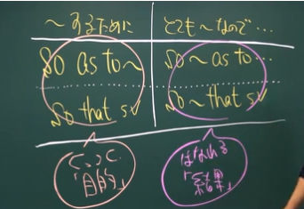

# 進め方
- TEPPAN英単語はずっとやる
- 並行してパーフェクト講義英文法編を始める3week
- 次はパーフェクト講座。間違えた問題は正解できるまで繰り返し学習7week
- 最後に実践問題集。1セットずつ完璧に仕上げることを優先
- アダプティブ講座は中上級者向け。実践問題集の前にやる？
- 英単語学習法
    - 1ヵ月に6回会った単語は覚えられる。
    - 毎日100単語×6回。うろ覚えでいい。英単語をみたらすぐ日本語がでるぐらい。
    - 3週間で100個ずつで4週目で300個を復習

# 基礎講座
- 分の成り立ち
    - 英語の語順: 主語→動詞→その他の語句
    - 英語の分の形: 肯定文、否定文、疑問文
- 名詞: 人や物を表す言葉
    - 主語、目的語、補語（主語＝補語）になる
    - 名詞によくある語尾: -tion,-ance,-ment,-ty,-ness,-cy,-th,-er
    - 前置詞は「名詞の前に置く詞（ことば）」なので、後ろには必ず名詞が続きます。
- 形容詞: 名詞を詳しく説明する言葉。名詞の前にくることが多い
    - 形容詞によくある語尾: -ful,-al,-ive,-ous,-ant,-ic,-able
    - veryは「とても～」と、形容詞や副詞を強調する言葉
- 副詞: 副える詞。なくても文として成立する。動詞や形容詞の前にくる。動詞や形容詞を詳しく説明する。
    - 副詞によくある語尾: -ly 形容詞＋ly
    - 文頭の副詞は、話し手の気持ちや確実性を副えて、文全体を修飾します。
- 前置詞: 後ろには名詞(時、場所など)
    - at ～に: at 5 A.M. (時刻)
    - on ～に: on Sunday, on June 1 (曜日、日にち)
    - in ～に: in May, in winter, in 2020 (月、季節、年)
    - for ～の間に: for ten years (期間)
    - during ～の間に: during the meeting (特定の期間)
    - by ～までに: by 7 o’clock (期限)
    - until ～までずっと: until this week (継続)
    - 県や町、国のようにある程度の広さを持った「場所」を表すときはin
    - amongは3つ以上のものに取り囲まれているイメージで「～の中から」「～の間に」
- 接続詞: 文の要素を繋ぐ。文と文を繋ぐ場合は文と文の間か、文頭におかれる
    - because ～なので
    - when ～する時
    - if もし～ならば
    - although ～だけど
    - while ～の間
    - since ～以来
    - whenは現在完了形の文につなげることはできません
- 動詞: 主語の状態や動作をあら詞
    - be動詞: 主語 be動詞(=) 後ろの言葉(補語)
    - 一般動詞: 主語 一般動詞(≠) 後ろの言葉(目的語など)
- 時制
    - will: 其の場で決めたこと
    - be going to: 以前から決めていたこと
    - 現在完了形: 過去から現在に続く動作や状態を表す
- 助動詞: 動詞を助ける詞
    - 助動詞の後ろの動詞は必ず原型
    - can ～できる,will ～だろう,must ～しなければならない,may ～かもしれない,should ～すべきだ
- 能動態: 動詞が「～する」
- 受動態: 動詞が「～される」 be動詞＋過去分詞　空所の直後には前置詞がある？
- 不定詞: 「to+動詞の原形」でできた固まり
    - 名詞: すること
    - 形容詞: するための
    - 副詞: するために
    - {want,ask ,advise} + 人 + to do: 人にto以下の事を～する
    - {let,make,heve} + 人 + do(動詞の原形): 人に～してもらう、させる(使役動詞)
- 動名詞: 動詞が名詞の働きをする詞 動詞＋ing
    - 名詞(主語、目的語、補語など)の働きをする
- 分詞: 動詞が変形して、形容詞の働きをする詞
    - 現在分詞: 動詞 + ~ing(~している)は形容詞の役割
    - 1語なら: 動詞 + ~ing 名詞
    - フレーズなら: 名詞 動詞 + ~ing フレーズ
    - 過去分詞: 動詞 + ~ed(~された)は形容詞の役割
- 代名詞: 名詞の代わりをする詞
    - 主格: 主語(~は)として使われる。
    - 目的格: 動詞の目的語(~に、~を)になる。
    - 所有格: 所有者(~の)を表す。
- 比較: 人や物を比べる時の形容詞と副詞の変化
    - 同じぐらい: as 形容詞 as 比較対象
    - 比較級 相手より~: 形容詞er than 比較対象 (more 形容詞 than)
    - 最上級 ~の中で1番: the 形容詞est 比較対象 (the most 形容詞)
    - good: better best
    - bad: worse worst
- 関係代名詞: 2つの文をつなぐ代名詞
    - 名詞(人) who 動詞 (thatと置き換え可)
    - 名詞(物) which 動詞 (thatと置き換え可)
    - 名詞(人) whom 主語 + 動詞 (thatと置き換え可,省略可)
    - 名詞(物) which 主語 + 動詞 (thatと置き換え可,省略可)
    - 名詞(人,物) whose 主語(名詞) + 動詞 (thatと置き換え不可,省略不可)
- 仮定法: 現実とは異なる想像を表す
    - If + 主語 + 動詞の過去形,主語 + <would,couldなど> + 動詞の原形
- 文型: 英文の語順ルールをかたにしたもの
    - 第1文型: 主語(S) 動詞(V) Vは自動詞(run,goなど)
    - 第2文型: 主語(S) 動詞(V) 補語(C)  S = C
    - 第3文型: 主語(S) 動詞(V) 目的語(O) S ≠ O  Vは他動詞(have,wantなど)
    - 第4文型: 主語(S) 動詞(V) 目的語(人)(O) 目的語(物)(O) O ≠ O  よく使われる他動詞(teach,tell,sendなど)
    - 第5文型: 主語(S) 動詞(V) 目的語(O) 補語(C) O = C  よく使われる他動詞(keep,make,findなど)

# パーフェクト講義 - 英文法編

- 基本時制(現在・未来・過去形)の概念
    - 現在系: 現在・過去・未来系？3つすべてに当てはまる時に使う
    - 過去形: 過去の1点
    - 未来系: 未来の1点(すぐ先でもOK)
    - 形から解く。manyの時は動詞にsはつかない。~ingは動詞にならない。など
- 現在系の特殊用法
    - 時・条件の副詞節の中では未来のことは現在系で表す
    - 時・条件は従属接続詞(if,whenなど)
    - (If sv), SV ifは副詞(If sv)は副詞節
    - ()のなかのvは現在系で表す。外のVは未来系で良い！
- 進行形の概念
    - 進行形 be + ~ing 「～している途中だ」途中だと思った方が良い。
    - resemble(似ている)は進行形にならない。
    - 手帳のメモにはbe + ~ingが使える(1歩でも進行している時)
    - 問題を解くときは形から
- 完了形の概念
    - 完了形はイメージで覚える
    - 過去から現在まで続いている。現在こうなってるみたいな感じ。現在がメイン
    - 過去完了形は過去から過去で、後者の過去がメイン
    - 未来完了形はどこか(過去でも現在でも)から未来で、未来がメイン。
- 仮定法の概念
    - 仮定法(妄想) If I had ~ 反対は 直説法(現実) If I have ~
    - `If 主語 過去形, 主語 would 原形` 仮定法過去(現在の妄想)
    - `If 主語 had pp, 主語 would have pp` 仮定法過去完了(昔の妄想)
    - 妄想なのでぶっ飛んだ事を言ってるのでIとかheにもwereを使うこともある。
    - suggest・propose・recommend・requestなど「命令」系統の動詞があると、that節の中はshould 原形／原形になります。
- 仮定法の倒置
    - `If 主語 should 原形, 主語 would(please) 原形` 未来。後半は色々ある
    - 仮定法のIfは省略できる。その場合は疑問文の語順になる。
    - 仮定法過去完了は`Had 主語 pp,主語 would have pp`
    - 未来系は`Should 主語 原形,~` この形の方が良く使う。
- 各助動詞の基本
    - 助動詞の後ろは動詞の原形
    - will: 必ず～する！強い意志を表す
- 不定詞の概念
    - 不定詞をとる動詞。want,intend,offer,hesitate,refuseなど
    - 不定詞は未来志向。これから～
    - 不定詞はプラスイメージ(明るい動詞はtoをとりやすい)
    - want to ~（～したい）、hope to ~（～したいと望む）、wish to ~（～したいと願う）の3つは確実に覚える。
- to 不定詞を使った慣用表現1
    - so as to ~ (～するために) so that SVと同じ　目的を表す
    - so ~ as to... (とても～なので) so ~ that SVと同じ　結果を表す
    