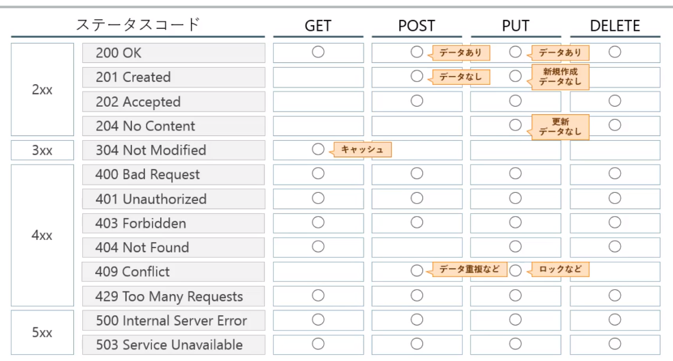

- API: 機能やデータを外部から呼び出して利用できるように定めた規約
- WebAPI
    - 何ができるか: 第3者が情報を利活用して新たな機能を開発
    - 何を公開するか: 価値あるもの(機能やデータ)をすべて公開
- メソッドの種類: 8種類ある。
    - `GET`: リソースの取得 Read
    - `POST`: リソースの作成 Create
    - `PUT`: リソースの更新、リソースの作成 Create,Update
    - `DELETE`: リソースの削除 Delete
    - 他は`OPTIONS`,`HEAD`,`TRACE`,`CONNECT`
    - Createで使うPOSTとPUTの違いはリソース名が決まっているかで決まる。POST(リソース名が未定)、PUT(リソース名が決まっている)
- ステータスコード: 大きく分けて5種類。大事なのは3つ
    - 2xx: Successリクエストが受け入れられて正常処理された。
    - 4xx: Client Errorリクエストに誤りがある。
    - 5xx: Server Errorサーバー処理失敗。
- 副作用: リソース(データ)が改変されること。(データを更新したり削除したり)
- 安全: 副作用がない。リソースの状態を変化させない読み取り専用。GET,HEAD
- 冪等(べきとう): 副作用の有無は問わずに、何度実行しても同じ状態が再現される。(0を掛けたりなど？)副作用がある: 更新PUT,DELETE　副作用がない:取得GET,HEAD
- データ登録は安全でも冪等でもない。POST
- `RESTful`: RESTで求められる原則に従っていること
- `REST`: 分散型システムにおける設計ルール
- `統一インターフェース`
    - リソース(名前が付けられるあらゆるもの。サーバー側に保持されるデータ)の識別: URIを用いてサーバーに保存されたデータを識別する。
    - 表現(リソースの断面。サーバーへPOSTするデータなど)を用いたリソース操作: 断面情報を利用してサーバー上のデータを操作する。
    - 自己記述メッセージ: メッセージ内容が何であるか、ヘッダーに記述されている。
    - アプリケーション状態エンジンとしてのハイパーメディア(HATEOS): レスポンスに現在の状態を踏まえて関連するハイパーリンクが含まれている。検索ページの次のページなど
- `ステートフル`: 前の状態を保存
- `ステートレス`: 前の状態を保存しない。単独で成り立つ。サーバーはリクエストだけでコンテキストを理解できる。
    - メリット: 監視が容易。障害復旧が容易。スケールが容易。
    - デメリット: リクエストデータに重複がある。アプリ制御が複雑になる。
- `キャッシュ制御`: クライアントはレスポンスをキャッシュできる。
    - メリット: ユーザー体験、リソース効率、拡張性の向上
    - デメリット: 古いデータを戻してしまうとシステムに対する信頼性の低下につながる
- REST API 設計レベル
    - レベル0: HTTPを使っている
    - レベル1: リソースの概念を導入
    - レベル2: HTTPの動詞を導入
    - レベル3: HATEOASの概念を導入
- URI設計で考慮すること
    - 短く入力しやすい(冗長なパスを含まない)
    - 人が読んで理解できる(できるだけ省略しない)
    - 大文字小文字が混在していない(すべて小文字)
    - 単語はハイフン(-)でつなげる
    - 単語は複数形を利用する
    - エンコードを必要とする文字を使わない(日本語など)
    - サーバー側のアーキテクチャを反映しない
    - 改造しやすい(Hackable)
    - ルールが統一されている
- `クエリパラメータ`: URLの末尾にある`?`に続くキーバリュー。省略可能な時に使う。検索条件など
- `パスパラメータ`: URL中に埋め込まれるパラメータ。一意なリソースを表すのに必要な時に使う。
- ステータスコード
    - `100 Continue`: サーバーがリクエストの最初の部分を受け取り、まだサーバーから拒否されていないことを示す。
    - `101 Switching Protocol`: プロトコルの切り替えを示す。
    - `200 OK`: 成功。本文にデータが含まれる
    - `201 Created`: リクエストが成功し、新しいリソースが作成されたことを示す。ヘッダーのLocationに新しいリソースのURLを含める。
    - `202 Accepted`: 非同期ジョブを受け付けたことを示す。実際の処理結果を別途受けとる。
    - `204 No Content`: リクエストは成功したが、レスポンスデータがないことを示す。クライアント側のビューを変更する必要がないことを意味する。
    - `400 Bad Request`: その他エラー。
    - `401 Unauthorized`: 認証されていないことを示す。
    - `403 Forbidden`: リソースに対するアクセスが許可されていないことを示す。
    - `404 Not Found`: リクエストされたリソースが存在しないことを示す。
    - `409 Conflict`: リソースが競合して処理が完了できなかったことを示す。
    - `429 Too Many Requests`: アクセス回数が制限回数を超えたため処理できなかったことを示す。(レートリミット)
    - `500 Internal Server Error`: サーバーサイドのアプリケーションエラーが発生したことを示す。
    - `503 Service Unavailable`: サービスが一時的に利用できないことを示す。メンテナンス期間た過負荷で応答できなようなケース。
- HTTPとステータスコード
    - GET 成功: `200 OK`,`304 Not Modidied`(キャッシュ利用),
    - GET 失敗: `400 Bad Request`(クライアント側のリクエスト不備),`401 Unauthorized`(認証エラー),`403 Forbidden`(認可エラー),`404 Not Found`(該当データなし),`429 Too Many Requests`(レートリミット),`500 Internal Server Error`(サーバー障害),`503 Service Unavailable`(高負荷で応答不可)
    - POST 成功: `200 OK`(レスポンスに登録済みデータを含む),`201 Created`(レスポンスボディーが空Locationに新しいリソースへのURL),`202 Accepted`(非同期処理の受付)
    - POST 失敗: 400,401,403,`409 Conflict`(データが衝突),429,500,503
    - PUT 成功: `200 OK`(レスポンスに登録済みデータを含む)`201 Created`(データ登録の時のみ),`204 No Content`(データ更新の時。レスポンスボディーにデータなし)
    - PUT 失敗: 400,401,403,404(データ更新の時),409(データ登録の時),429,500,503
    - DELETE 成功: 200,202,204(正常。できるだけ204を使う)
    - DELETE 失敗: 400,401,403,404,429,500,503

- データフォーマット
    - `XML`: テキスト形式。タグで記述。タグは入れ子にできる。タグに属性が付けられる。
    - `JSON`: テキスト形式。JavaScriptを元にしたフォーマット。XMLに比べてデータ量が減らせる。オブジェクトは入れ子にできる。
    - `JOSNP`: テキスト形式。データフォーマットのように見えるがJavaScriptコード。クロスドメインでデータを受け渡すことができる。
- データフォーマットの指定方法
    - クエリパラメータ: `http://... format=json`
    - 拡張子: `http://... .json` あまり使わない
    - リクエストヘッダー: `Accept: ../json` 一番お行儀が良い
- データの内部構造の設計で考慮すること
    - エンベローブ(レスポンスボディー内のメタ情報)は使わない
    - オブジェクトはできるだけフラットにする
    - ページネーションをサポートする情報を返す
    - プロパティの命名規則はAPI全体で統一する
    - 日付はRFC3339(W3C-DTF)形式を使う。例: `2018-03-29T17:00:00+09:00`
    - 大きな数値(64bit整数)は文字列で返す
- エラー表現で考慮すること
    - エラー詳細はレスポンスボディーに入れる
    - エラーの際にHTMLが返らないようにする
    - サービス閉塞時は"503" + "Retry-After"
- APIバージョンを含めるか？
    - メリット: 特定バージョン指定でアクセスできるので、クライアント側で突然エラーにならない
    - デメリット: 複数バージョンを並列稼働させるため、ソースコードやデータベースの管理が複雑になる
- バージョンを入れる場所: パス、クエリ、ヘッダー。パスが多い。
- バージョンのつけ方: セマンティックバージョニング
- 認証: 本人特定
- 認可: アクセス制御
- `OAuth`: 認可。アクセストークンが返ってくる。
- `OpenID Connect`: OAuthに本人情報取得を加えた仕組み。アクセストークンとIDトークン(JSON Web Token)が返ってくる。
- `JSON Web Token(JWT)`: ジョットと読む。署名による改ざんチェック。URL-safeなデータ。データの中身はJSON形式。`文字列(ヘッダー) . 文字列(ペイロード) . 文字列(署名)
    - ヘッダー: 署名で利用できるアルゴリズムなどを定義
    - ペイロード: 保存したいデータの実態
    - 署名: 改ざんされていないか確認するための署名
- `レートリミット`: 時間当たりのアクセス制限。
- キャッシュ制御
    - `Expires`: キャッシュとしていつまで利用可能かの期限を指定。過去日を指定すると有効期限切れであることを意味する。Cache-Controlが同時に指定されていると、無視される
    - `Cache-Control + Date`: Cache-Controlでキャッシュの可否と期限を指定
    - `Last-Modified + Etag`: Last-Modifiedにリソースの最終更新日時を指定。Etagに特定バージョンを示す文字列を指定
- 代表的な脆弱性対策
    - `XSS`: 正規のサイトに不正なスクリプトを挿入して情報を不正な引き出したりしてしまう問題
    - `CSRF`: 本来拒否しなければいけないアクセス元からくるリクエストを処理してしまう問題
    - `HTTP`: 通信経路が暗号化されないので盗聴されやすい。常時HTTPSを利用する。
    - `JWT`: クライアント側で内容の確認、編集が簡単にできるため、サーバー側の検証が不十分だと改ざんされた情報を正規として受け入れてしまう。