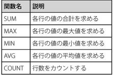

- `DML`: データを操作する言語
- `DDL`: データを定義する言語
- `DCL`: データを制御する言語
- `レコード`: 1行ごとのデータ(横)
- `カラム`: 列(縦)
- 列指定は`SELECT`文。行指定は`WHERE`文
- `GROUP BY`は`WHERE`と`ORDER BY`の間に書く
- `HAVING`: グルーピングされたデータの中から、さらに特定の条件でデータを抽出する。`GROUP BY`と`ORDER BY`の間に書く
- SQLは`FROM`,`WHERE`,`GROUP BY`,`HAVING`,`SELECT`,`ORDER BY`の順で実行される。
- `DUMP`: バックアップを取る。postgresqlだと`pg_dump`コマンド。`pg_dump database名 > ファイル名`
- リストアは`psql database名 < ファイル名`
- `BETWEEN`: 範囲指定。`BETWEEN 下限値 AND 上限値`不等号を使うより可読性が高い。notを使うと指定範囲外を選択できる。
- `DESTINCT`: 値の重複を排除してカラムを抽出。
- 正規表現は`~`の後に書いて使う。SQLiteでは`REGEXP`
- データを追加。`INSERT INTO テーブル名 VALUES (値)`
- データの更新は`UPDATE テーブル名 SET カラム名 = 値`WHEREなどで指定する。
- データの削除は`DELETE FROM テーブル名`WHEREなどで指定する。
- ハイフン2つから行末まではコメント。ctrl+/でもOK
- `DML`: データ操作。`SELECT`,`UPDATE`,`DELETE`,`INSERT`
- `AS`: 列名やテーブル名の記述の後につけて別名をつけることができる。
- `IS NULL 演算子`: NULLであることを判定する。例:`WHERE 出金額 IS NULL`。反対派`IS NOT NULL`
- `LIKE 演算子`: パターンマッチ。`式 LIKE パターン文字列`例: `WHERE メモ LIKE '%1月%`。%: 任意の0文字以上の文字列。_: 任意の1文字。%や_を指定したい時は`ESCAPE句`を使う。
- `IN 演算子`: カッコ内の複数の値のいずれかにデータが合致するか判定する演算子。`式 IN (値1,値2,値3...)`反対は`NOT IN` 似たようなもので`ANY`と`ALL`もある。
- 論理演算子の優先順位は`NOT`,`AND`,`OR`の順番
- `DISTINCT`: 検索結果から重複行を除外する。SELECT文の最初に記述する必要がある。
```sql
SELECT DISTINCT 列名
FROM テーブル名
```
- `ORDER BY`: 検索結果の順序を並べ替える。ASCが昇順でデフォルト。複数
```sql
SELECT 列名 FROM テーブル名
ORDER BY 列名 並び順 --ASCまたはDESC
```
- `OFFSET -FETCH`: 検索結果から件数を限定して取得する。
```sql
SELECT 列名 FROM テーブル名
ORDER BY 列名 並び順
OFFSET 先頭から除外する行数 ROWS
FETCH NEXT 取得行数 ROWS ONLY
```
- `UNION`: 検索結果に他の検索結果を足し合わせる。和集合。検索結果の列数やデータ型が同じでないといけない。列が足りない場合はNULLを使う。
```sql
SELECT xx1
UNION
SELECT xx2
```
- `EXCEPT`: 検索結果から他の検索結果を差し引く。差集合。書き方は`UNION`と同じ
- `INTERSECT`: 検索結果と他の検索結果で重複する部分を取得する。積集合。書き方は`UNION`と同じ。
- ORDER BYはかなり負荷のかかる作業なので注意。
- SELECT文などで`列名 + 100`のように計算式や固定値を入れることができる。
- 代表的な演算子の使い方

- `CASE演算子`: 列の値や条件式を評価して、その結果に応じて自由に変換する。2通りの使い方がある
```sql
CASE 評価する列や式 WHEN 値1 THEN 値1の時に返す値
                   (WHEN 値2 THEN 値2の時に返す値)...
                   (ELSE デフォルト値)
END
```
```sql
CASE WHEN 条件1 THEN 条件1の時に返す値
    (WHEN 条件2 THEN 条件2の時に返す値)...
    (ELSE デフォルト値)
END
```
`LENGTH関数`: 文字列の長さを表す数値を返す。引数は列名または式
`TRIM関数`: 文字列の前後の空白を取り除く。先頭にLで左のみRで右のみの空白を消せる。LTRIM,RTRIM
- `REPLACE関数`: 文字列の一部を別の文字列に置換する。`REPLACE (置換対象の文字列, 置換前の部分文字列, 置換後の部分文字列)`
- `SUBSTRING関数`: 文字列の一部分だけを取り出す。`SUBSTRING (文字列を表す列, 抽出を開始する位置, 抽出する文字の数)`
- `CONCAT関数`: 文字列を連結する。`CONCAT (文字列, 文字列,...)`
- `ROUND関数`: 指定した位置で四捨五入をした結果を返す。`ROUND (列, 有効とする桁数)`切れり捨ての場合は`TRUNC`
- `POWER関数`: べき乗を返す。
- `CURRENT_TIMESTAMP`: 現在の日時
- `CURRENT_DATE`: 現在の日付
- `CURRENT_TIME`: 現在の時刻
- `CAST関数`: あるデータ型を別の型として扱うようにする。`CAST (変換する値 AS 変換する型)`
- `COALESCE`: 複数の引数を受け取り、受け取った引数を左から順番にチェックしてその中から最初に見つかったNULLでない引数を返す。NULLガード
- 関数はDBMSによって大きく異なるので注意。
- 関数は負荷が増大する可能性があるので注意
- 代表的な集計関数

- `COUNT関数`: 検索結果の行数を数える。`COUNT(列)`だとNULLを無視してカウントする。
- 集計関数はSELECT文でしか利用できない。
- グループ化: 集計に先立って、指定した基準で検索結果をいくつかのまとまりに分けること。基本構文:
```sql
SELECT グループ化の基準列名... , 集計関数
FROM テーブル名
(WHERE 絞り込み条件)
GROUP BY グループ化の基準列名...
HAVING 集計結果に対する絞り込み条件
```
- グループ集計の流れ

- `HAVING`: 集計処理を行ったあとの結果表に対して絞り込みを行う。
- SELECT文の基本構文

- 集計テーブル: 大量のデータを扱う場合に使う。集計結果をあらかじめ別のテーブルに登録しておく。
- `リレーションシップ`: ある2つのテーブルの間に情報としての関連のこと。
- `外部キー`: 他のテーブルの関連行を指すための値を格納してリレーションシップを結ぶ役割を持つ列。
- テーブルを複数に分けると変数みたいにできる。
- JOINの書き方
```sql
SELECT 選択列リスト
FROM テーブルA
JOIN テーブルB
ON 両テーブルの結合条件
```
- `LEFT JOIN`: 左外部結合。結合相手の行がない場合やNULLの場合でも行が消えない。右もある
- 各テーブルごとに同じ名前の列がある時は`テーブル名.列名`のように記述する。FROMやJOINでテーブルを指定するときにASで簡素な名前を付けておくと、簡素に書ける。
- 3つ以上のテーブルも結合できる。
- 副問い合わせの結果とも結合できる。
- トランザクション: DBMSに対して複数のSQL文を送る際、1つ以上のSQL文をひとかたまりとして扱うように指示できる。そのかたまりのこと。
- トランザクションを使うための指示
    - `BEGIN`: 開始の指示。
    - `COMMIT`: 終了の指示。
    - `ROLLBACK`: 明示的にロールバッグを発生させる。
- 一般的なトランザクション分離レベル

- たいていは`READ COMMITTED`を選んでおけばOK
```sql
SET TRANSACTION ISOLATION LEVEL 分離レベル
SET CURRENT ISOLATION 分離レベル
```
- `GRANT`: テーブル操作の権限を付与する
- `REVOKE`: テーブル操作の権限をはく奪する
```sql
GRANT 権限名 TO ユーザー名
REVOKE 権限名 TO ユーザー名
```
- `CREATETABLE`: テーブルを作成する。
```sql
CREATE TABLE テーブル名 (
    列名1 列1の型名,
    列名2 列2の型名
    :
    :
)
```
- `DEFAULT`: デフォルト値を設定できる。型名のあとに記述`DEFAULT デフォルト値`
- `DROP TABLE`: テーブル削除
- `ALTER TABLE`: テーブルの更新
```sql
-- 列の追加
ALTER TABLE テーブル名 ADD 列名 型
-- 列の削除
ALTER TABLE テーブル名 DROP 列名
```
- 列名の後に制約を指定できる。
- `NOT NULL`: NULLができない。
- `UNIQUE`: 重複禁止
- `CHECK`: CHECKの後のカッコ内の条件式が真となるような値のみ格納できる。
- `PRIMARY KEY`: 主キーを指定できる。